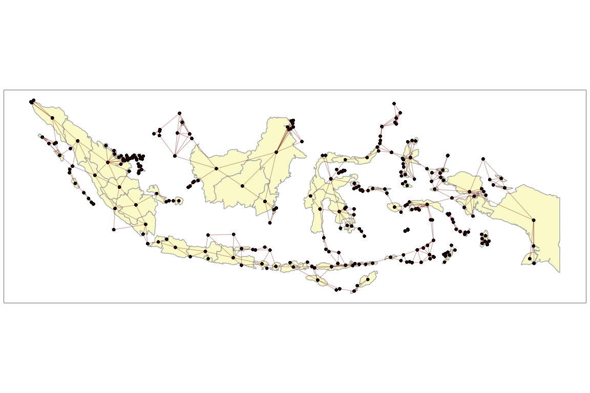
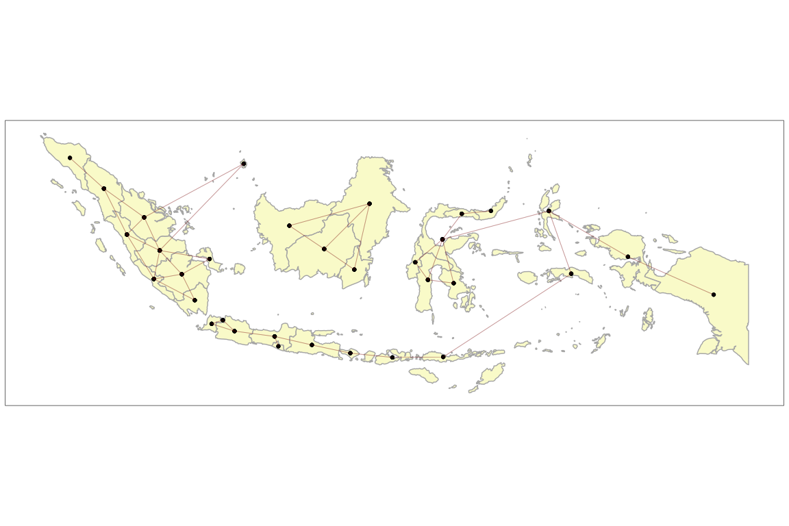
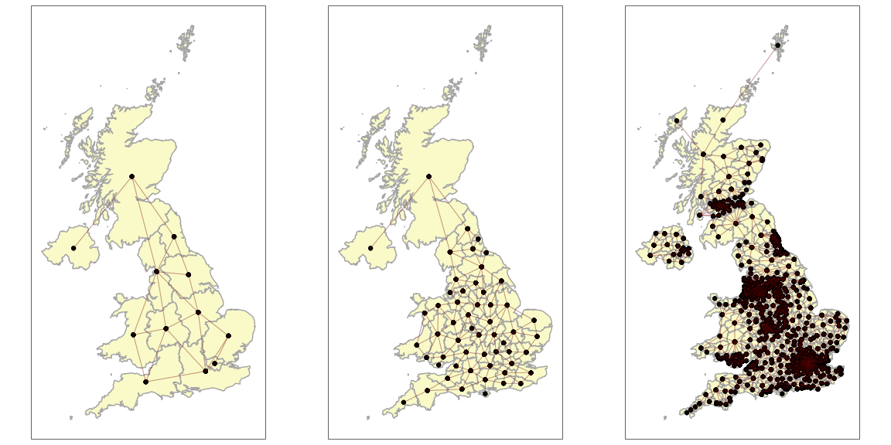
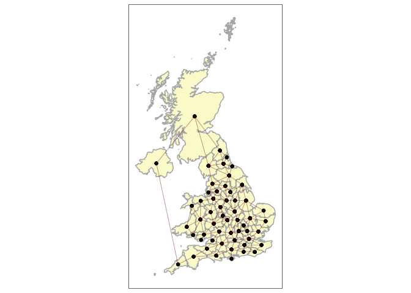
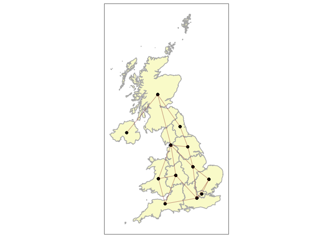

<!-- README.md is generated from README.Rmd. Please edit that file -->

# kh package

<!-- badges: start -->
<!-- badges: end -->

The goal of `kh` is to make it easier to fit spatial models which deal
with contiguity.

It aims to do this with a collection of pre and post-processing tools.

Two packages which are commonly used to fit such models are `mgcv` and
`brms`.

The pre-processing tools take an `sf` spatial object and generate a
contiguity structure in the form which is required by the modelling
package.

The post-processing tools then extract the results of the model into a
tidy `sf` format so they can easily be mapped.

## Installation

You can install the development version of `kh` from
[GitHub](https://github.com/) with:

``` r
# install.packages("devtools")
devtools::install_github("horankev/kh")
```

For this example, we load some spatial data from these sources:

``` r
# required packages
packages <- c(
  "rnaturalearth",
  "sf",
  "tidyverse",
  "parlitools",
  "ggpubr",
  "mgcv"
  )

# Install packages not yet installed
installed_packages <- packages %in% rownames(installed.packages())
if (any(installed_packages == FALSE)) {
  install.packages(packages[!installed_packages])
}

# Packages loading
invisible(lapply(packages, library, character.only = TRUE, quietly = TRUE))
```

## Example

### Pre-processing functions

The following functions are useful for preparing an `sf` object for use
with `mgcv`:

| Function                | Purpose                                                                                                              |
|-------------------------|----------------------------------------------------------------------------------------------------------------------|
| make_cont_k_islands()   | generates a contiguity object, by any chosen level, with the option of joining islands to their nearest k neighbours |
| find_neighbours()       | outputs the names of any unit’s neighbours within the contiguity object                                              |
| manual_link_name()      | link two units (by name) as neighbours which are not already neighbours                                              |
| manual_unlink_name()    | unlink two units (by name) which are currently neighbours                                                            |
| manual_link_numeric()   | link two units (by index number) as neighbours which are not already neighbours                                      |
| manual_unlink_numeric() | unlink two units (by index number) which are currently neighbours                                                    |
| makemap()               | generates a quick-reference contiguity map of a contiguity object                                                    |

Often when preparing areal spatial data, the presence of uncontiguous
areas (such as islands or exclaves) can create difficulties. These
functions help to make the process of generating spatial structures less
complicated.

``` r
library(kh)
## basic example code
```

The following is a map of the UK from the `rnaturalearth` package. It
features many non-contiguous units. In the following example of
`make_cont_k_islands`, the argument k is set to one. This means that in
addition to all of the normal contiguities, all islands will be joined
to the one unit which is closest to them. This can be piped into the
`makemap` function so that the contiguities can be visually inspected.

``` r

uk <- ne_states(country="united kingdom", returnclass = "sf") |> 
  st_cast("POLYGON")
uk$id <- 1:nrow(uk)

uk_cont <- make_cont_k_islands(data = uk,
                    unit = id,
                    link_islands_k = 1) |> 
  makemap(uk, id)
```


This could be changed to join each island to the two closest units as in
this example with the countries of Asia.

``` r

asia <- ne_countries(continent="asia", returnclass = "sf")
asia_cont <- make_cont_k_islands(data = asia,
                    unit = admin,
                    link_islands_k = 2) |> 
  makemap(asia, admin)
```


And for a country such as Indonesia which has many islands.

``` r

indonesia <- ne_states(country="indonesia", returnclass = "sf") |> 
  st_cast("POLYGON")
indonesia$id <-1:nrow(indonesia)
indonesia_cont <- make_cont_k_islands(data = indonesia,
                    unit = id,
                    link_islands_k = 2) |> 
  makemap(indonesia, id)
```



Rather than operating at the individual island level, this can be done
at a higher level by changing an argument in the function.

``` r

indonesia <- ne_states(country="indonesia", returnclass = "sf") |> 
  st_cast("POLYGON")
indonesia$id <-1:nrow(indonesia)
indonesia_cont <- make_cont_k_islands(data = indonesia,
                    unit = name,
                    link_islands_k = 2) |> 
  makemap(indonesia, name)
```



Applied to the situation of modelling voting behaviour in the UK, we can
set up contiguities according to administrative level.

``` r

# prepare the data
# extract and join census and election data from parlitools package
census_11 <- parlitools::census_11 |> 
  select(-constituency_name,-constituency_type,-pano, -region, -country)
bes_2019 <- parlitools::bes_2019

elect_results <- left_join(bes_2019,census_11, by=c("ons_const_id"))
uk_map_download <- st_read(
  "https://services1.arcgis.com/ESMARspQHYMw9BZ9/arcgis/rest/services/WPC_Dec_2019_UGCB_UK_2022/FeatureServer/0/query?outFields=*&where=1%3D1&f=geojson",
  quiet = TRUE)

# only need the boundaries and the IDs for merging with parlitools data
uk <- uk_map_download |> 
  select(pcon19cd,geometry) |> 
  st_transform(crs=27700)

uk_admins <- elect_results |> 
  left_join(uk, by=c("ons_const_id"="pcon19cd")) |> 
  mutate(region = factor(region),
         county = factor(county),
         constituency_name = factor(constituency_name),
         geometry = geometry) |> 
  st_as_sf()
```

For regions, counties and constituencies:

``` r

ggarrange(
uk_admins |> 
  make_cont_k_islands(unit = region,
                    link_islands_k = 1) |> 
  makemap(uk_admins, region),

uk_admins |> 
  make_cont_k_islands(unit = county,
                    link_islands_k = 1) |> 
  makemap(uk_admins, county),

uk_admins |> 
  make_cont_k_islands(unit = constituency_name,
                    link_islands_k = 1) |> 
  makemap(uk_admins, constituency_name),

ncol=3
)
```



We can use `manual_link_name` to add additional contiguities using the
name of the units. This can also be done using the number of the unit
(which is provided in the neighbourhood list, rather than the names)
using `manual_link_numeric`. Here we link Northern Ireland to Cornwall:

``` r

manual_link_name(
  make_cont_k_islands(data = uk_admins,
                      unit = county,
                    link_islands_k = 1),
  "Northern Ireland",
  "Cornwall") |> 
  makemap(uk_admins, county)
```



or `manual_unlink_name` to unlink units using their names. Here, we
unlink the East and West Midlands, and also the North West and East:

``` r

manual_unlink_name(
  make_cont_k_islands(data = uk_admins,
                      unit = region,
                      link_islands_k = 1),
  "East Midlands",
  "West Midlands") |> 
  manual_unlink_name(
    "North West",
    "North East") |> 
  makemap(uk_admins, region)
```



In the following example, we link island constituencies to their nearest
3 constituencies:

``` r

uk_admins |> 
  make_cont_k_islands(unit = constituency_name,
                    link_islands_k = 3) |> 
  makemap(uk_admins, constituency_name)
```


But which three constituencies have now been link to the Isle of Wight?
Using the `find_neighbours` function…

``` r

find_neighbours(
  uk_admins |> 
  make_cont_k_islands(unit = constituency_name,
                    link_islands_k = 3),
  "Isle Of Wight"
)
#> [1] "Gosport"         "New Forest East" "New Forest West"
```

I only wanted Gosport. So I will remove the other two…

``` r

find_neighbours(
uk_admins |> 
  make_cont_k_islands(unit = constituency_name,
                    link_islands_k = 3) |> 
  manual_unlink_name("Isle Of Wight","New Forest East") |> 
  manual_unlink_name("Isle Of Wight","New Forest West"),
"Isle Of Wight"
)
#> [1] "Gosport"
```

### Post-processing functions

The function `get_output` takes a fitted `mgcv::gam` model and returns
the estimates for the smooths and fixed effects, attached to an
appropriate (spatial) dataframe.

``` r

nb_england <- uk_admins |> 
  filter(country %in% "England") |> 
  make_cont_k_islands(unit = constituency_name,
                    link_islands_k = 3) |> 
  manual_unlink_name("Isle Of Wight","New Forest East") |> 
  manual_unlink_name("Isle Of Wight","New Forest West")
  
df_england <- uk_admins |> 
  filter(country %in% "England") |> 
  mutate(constituency_name = factor(constituency_name),
         region = factor(region),
         county = factor(county))

model <- gam(con_17 ~ 
               born_england + 
               deprived_1 + 
               degree + 
               s(region, bs="re") +
               s(county, bs="re") +
               s(constituency_name, by=born_england, bs='mrf', xt=list(nb=nb_england),k=50) +
               s(constituency_name, by=deprived_1, bs='mrf', xt=list(nb=nb_england),k=50) +
               s(constituency_name, by=degree, bs='mrf', xt=list(nb=nb_england),k=50),
             data=df_england, method="REML")

output <- get_output(model, df_england)
head(output[,1:10])
#> Simple feature collection with 6 features and 10 fields
#> Geometry type: MULTIPOLYGON
#> Dimension:     XY
#> Bounding box:  xmin: 368282 ymin: 101579.6 xmax: 532401.3 ymax: 393553.9
#> Projected CRS: OSGB36 / British National Grid
#>   smooth_region smooth_county smooth_constituency_name.born_england
#> 1  6.073839e-04      1.706711                            0.14626343
#> 2 -5.774813e-05     -2.703870                            0.01976628
#> 3 -4.414490e-04     -1.505832                           -0.14059956
#> 4  2.417885e-05      1.090575                           -0.02753703
#> 5  6.073839e-04      2.668064                            0.07881616
#> 6  2.417885e-05     -2.382387                           -0.03074957
#>   smooth_constituency_name.deprived_1 smooth_constituency_name.degree
#> 1                           0.8686497                      0.07696118
#> 2                           0.5955433                      0.63881553
#> 3                           0.3872410                      0.69905686
#> 4                           0.5640869                      0.43623841
#> 5                           0.7893368                     -0.21499099
#> 6                           0.5640568                      0.40074433
#>   fixed_born_england fixed_deprived_1 fixed_degree smoothse_region
#> 1            1.25084                0            0      0.03766500
#> 2            1.25084                0            0      0.03766566
#> 3            1.25084                0            0      0.03766621
#> 4            1.25084                0            0      0.03766501
#> 5            1.25084                0            0      0.03766500
#> 6            1.25084                0            0      0.03766501
#>   smoothse_county                       geometry
#> 1        2.508186 MULTIPOLYGON (((485408.1 15...
#> 2        2.365326 MULTIPOLYGON (((406519.5 30...
#> 3        2.358090 MULTIPOLYGON (((379104.1 39...
#> 4        2.264675 MULTIPOLYGON (((444868.5 35...
#> 5        2.513013 MULTIPOLYGON (((506643.3 12...
#> 6        2.596432 MULTIPOLYGON (((449576.1 36...

# quickmap_smooths(output)
```
