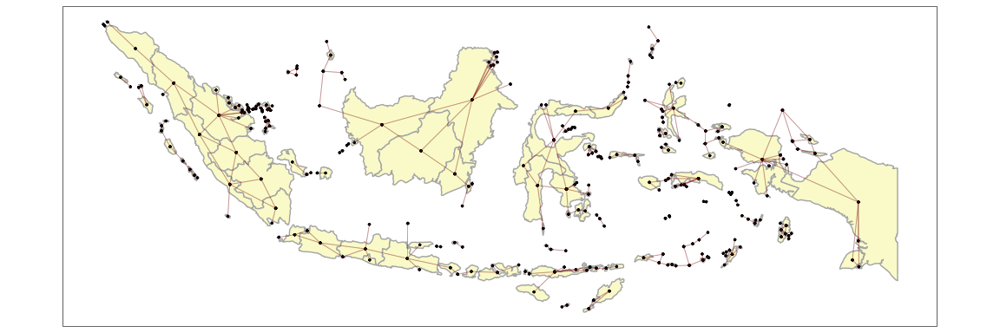

<!-- README.md is generated from README.Rmd. Please edit that file -->

# kh package

<!-- badges: start -->
<!-- badges: end -->

The goal of kh is to …

## Installation

You can install the development version of `kh` from
[GitHub](https://github.com/) with:

``` r
# install.packages("devtools")
devtools::install_github("horankev/kh")
```

``` r
# required packages
packages <- c(
  "rnaturalearth",
  "sf"
  )

# Install packages not yet installed
installed_packages <- packages %in% rownames(installed.packages())
if (any(installed_packages == FALSE)) {
  install.packages(packages[!installed_packages])
}

# Packages loading
invisible(lapply(packages, library, character.only = TRUE, quietly = TRUE))
#> Support for Spatial objects (`sp`) will be deprecated in {rnaturalearth} and will be removed in a future release of the package. Please use `sf` objects with {rnaturalearth}. For example: `ne_download(returnclass = 'sf')`
#> Linking to GEOS 3.11.0, GDAL 3.5.3, PROJ 9.1.0; sf_use_s2() is TRUE
```

## Example

Often when preparing areal spatial data, the presence of uncontiguous
areas (usually islands) can create difficulties. These functions help to
make the process of generating spatial structures less complicated.

``` r
library(kh)
## basic example code
```

The following is a map of the UK from the `rnaturalearth` package. It
features many non-contiguous units. In the following example of
`make_cont_k_islands`, the argument k is set to one. This means that in
addition to all of the normal contiguities, all islands will be joined
to the one unit which is closest to them. This can be piped into the
`makemap` function so that the contiguities can be visually inspected.

``` r

uk <- ne_states(country="united kingdom", returnclass = "sf") |> 
  st_cast("POLYGON")
uk$id <- 1:nrow(uk)

uk_cont <- make_cont_k_islands(data = uk,
                    unit = id,
                    link_islands_k = 1) |> 
  makemap(uk, id)
```



This could be changed to join each island to the two closest units as in
this example with the countries of Asia.

``` r

asia <- ne_countries(continent="asia", returnclass = "sf")
asia_cont <- make_cont_k_islands(data = asia,
                    unit = admin,
                    link_islands_k = 2) |> 
  makemap(asia, admin)
```


And for a country such as Indonesia which has many islands.

``` r

indonesia <- ne_states(country="indonesia", returnclass = "sf") |> 
  st_cast("POLYGON")
indonesia$id <-1:nrow(indonesia)
indonesia_cont <- make_cont_k_islands(data = indonesia,
                    unit = id,
                    link_islands_k = 2) |> 
  makemap(indonesia, id)
```


Rather than operating at the individual island level, this can be done
at a higher level by changing an argument in the function.

``` r

indonesia <- ne_states(country="indonesia", returnclass = "sf") |> 
  st_cast("POLYGON")
indonesia$id <-1:nrow(indonesia)
indonesia_cont <- make_cont_k_islands(data = indonesia,
                    unit = name,
                    link_islands_k = 2) |> 
  makemap(indonesia, name)
```


