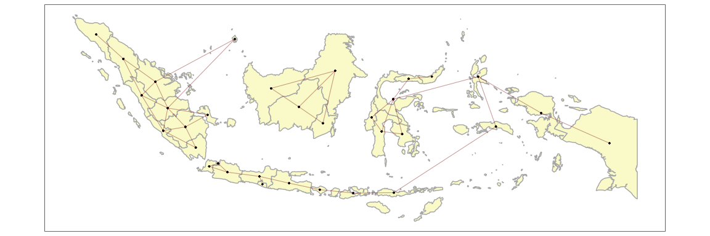

<!-- README.md is generated from README.Rmd. Please edit that file -->

# kh package

<!-- badges: start -->
<!-- badges: end -->

The goal of kh is to make it easier to fit spatial models which deal
with contiguity.

The functions described below deal with the initial set-up of such a
model where a neighbourhood list must be created.

## Installation

You can install the development version of `kh` from
[GitHub](https://github.com/) with:

``` r
# install.packages("devtools")
devtools::install_github("horankev/kh")
```

For this example, we load some spatial data from these sources:

``` r
# required packages
packages <- c(
  "rnaturalearth",
  "sf",
  "tidyverse",
  "parlitools",
  "ggpubr"
  )

# Install packages not yet installed
installed_packages <- packages %in% rownames(installed.packages())
if (any(installed_packages == FALSE)) {
  install.packages(packages[!installed_packages])
}

# Packages loading
invisible(lapply(packages, library, character.only = TRUE, quietly = TRUE))
#> Support for Spatial objects (`sp`) will be deprecated in {rnaturalearth} and will be removed in a future release of the package. Please use `sf` objects with {rnaturalearth}. For example: `ne_download(returnclass = 'sf')`
#> Linking to GEOS 3.11.0, GDAL 3.5.3, PROJ 9.1.0; sf_use_s2() is TRUE
#> ── Attaching core tidyverse packages ──────────────────────── tidyverse 2.0.0 ──
#> ✔ dplyr     1.1.4     ✔ readr     2.1.4
#> ✔ forcats   1.0.0     ✔ stringr   1.5.1
#> ✔ ggplot2   3.4.4     ✔ tibble    3.2.1
#> ✔ lubridate 1.9.2     ✔ tidyr     1.3.0
#> ✔ purrr     1.0.2     
#> ── Conflicts ────────────────────────────────────────── tidyverse_conflicts() ──
#> ✖ dplyr::filter() masks stats::filter()
#> ✖ dplyr::lag()    masks stats::lag()
#> ℹ Use the conflicted package (<http://conflicted.r-lib.org/>) to force all conflicts to become errors
```

## Example

Often when preparing areal spatial data, the presence of uncontiguous
areas (such as islands or exclaves) can create difficulties. These
functions help to make the process of generating spatial structures less
complicated.

``` r
library(kh)
## basic example code
```

The following is a map of the UK from the `rnaturalearth` package. It
features many non-contiguous units. In the following example of
`make_cont_k_islands`, the argument k is set to one. This means that in
addition to all of the normal contiguities, all islands will be joined
to the one unit which is closest to them. This can be piped into the
`makemap` function so that the contiguities can be visually inspected.

``` r

uk <- ne_states(country="united kingdom", returnclass = "sf") |> 
  st_cast("POLYGON")
uk$id <- 1:nrow(uk)

uk_cont <- make_cont_k_islands(data = uk,
                    unit = id,
                    link_islands_k = 1) |> 
  makemap(uk, id)
```


This could be changed to join each island to the two closest units as in
this example with the countries of Asia.

``` r

asia <- ne_countries(continent="asia", returnclass = "sf")
asia_cont <- make_cont_k_islands(data = asia,
                    unit = admin,
                    link_islands_k = 2) |> 
  makemap(asia, admin)
```


And for a country such as Indonesia which has many islands.

``` r

indonesia <- ne_states(country="indonesia", returnclass = "sf") |> 
  st_cast("POLYGON")
indonesia$id <-1:nrow(indonesia)
indonesia_cont <- make_cont_k_islands(data = indonesia,
                    unit = id,
                    link_islands_k = 2) |> 
  makemap(indonesia, id)
```



Rather than operating at the individual island level, this can be done
at a higher level by changing an argument in the function.

``` r

indonesia <- ne_states(country="indonesia", returnclass = "sf") |> 
  st_cast("POLYGON")
indonesia$id <-1:nrow(indonesia)
indonesia_cont <- make_cont_k_islands(data = indonesia,
                    unit = name,
                    link_islands_k = 2) |> 
  makemap(indonesia, name)
```


Applied to the situation of modelling voting behaviour in the UK, we can
set up contiguities according to administrative level.

``` r

# prepare the data
# extract and join census and election data from parlitools package
census_11 <- parlitools::census_11 |> 
  select(-constituency_name,-constituency_type,-pano, -region, -country)
bes_2019 <- parlitools::bes_2019

elect_results <- left_join(bes_2019,census_11, by=c("ons_const_id"))
uk_map_download <- st_read(
  "https://services1.arcgis.com/ESMARspQHYMw9BZ9/arcgis/rest/services/WPC_Dec_2019_UGCB_UK_2022/FeatureServer/0/query?outFields=*&where=1%3D1&f=geojson",
  quiet = TRUE)

# only need the boundaries and the IDs for merging with parlitools data
uk <- uk_map_download |> 
  select(pcon19cd,geometry) |> 
  st_transform(crs=27700)

uk_admins <- elect_results |> 
  left_join(uk, by=c("ons_const_id"="pcon19cd")) |> 
  mutate(region = factor(region),
         county = factor(county),
         constituency_name = factor(constituency_name),
         geometry = geometry) |> 
  st_as_sf()
```

For regions, counties and constituencies:

``` r

ggarrange(
uk_admins |> 
  make_cont_k_islands(unit = region,
                    link_islands_k = 1) |> 
  makemap(uk_admins, region),

uk_admins |> 
  make_cont_k_islands(unit = county,
                    link_islands_k = 1) |> 
  makemap(uk_admins, county),

uk_admins |> 
  make_cont_k_islands(unit = constituency_name,
                    link_islands_k = 1) |> 
  makemap(uk_admins, constituency_name),

ncol=3
)
```


We can use `manual_link_name` to add additional contiguities using the
name of the units. This can also be done using the number of the unit
(which is provided in the neighbourhood list, rather than the names)
using `manual_link_numeric`. Here we link Northern Ireland to Cornwall:

``` r

manual_link_name(
  make_cont_k_islands(data = uk_admins,
                      unit = county,
                    link_islands_k = 1),
  "Northern Ireland",
  "Cornwall") |> 
  makemap(uk_admins, county)
```


or `manual_unlink_name` to unlink units using their names. Here, we
unlink the East and West Midlands, and also the North West and East:

``` r

manual_unlink_name(
  make_cont_k_islands(data = uk_admins,
                      unit = region,
                      link_islands_k = 1),
  "East Midlands",
  "West Midlands") |> 
  manual_unlink_name(
    "North West",
    "North East") |> 
  makemap(uk_admins, region)
```


In the following example, we link island constituencies to their nearest
3 constituencies:

``` r

uk_admins |> 
  make_cont_k_islands(unit = constituency_name,
                    link_islands_k = 3) |> 
  makemap(uk_admins, constituency_name)
```


But which three constituencies have now been link to the Isle of Wight?
Using the `find_neighbours` function…

``` r

find_neighbours(
  uk_admins |> 
  make_cont_k_islands(unit = constituency_name,
                    link_islands_k = 3),
  "Isle Of Wight"
)
#> [1] "Gosport"         "New Forest East" "New Forest West"
```

I only wanted Gosport. So I will remove the other two…

``` r

find_neighbours(
uk_admins |> 
  make_cont_k_islands(unit = constituency_name,
                    link_islands_k = 3) |> 
  manual_unlink_name("Isle Of Wight","New Forest East") |> 
  manual_unlink_name("Isle Of Wight","New Forest West"),
"Isle Of Wight"
)
#> [1] "Gosport"
```
