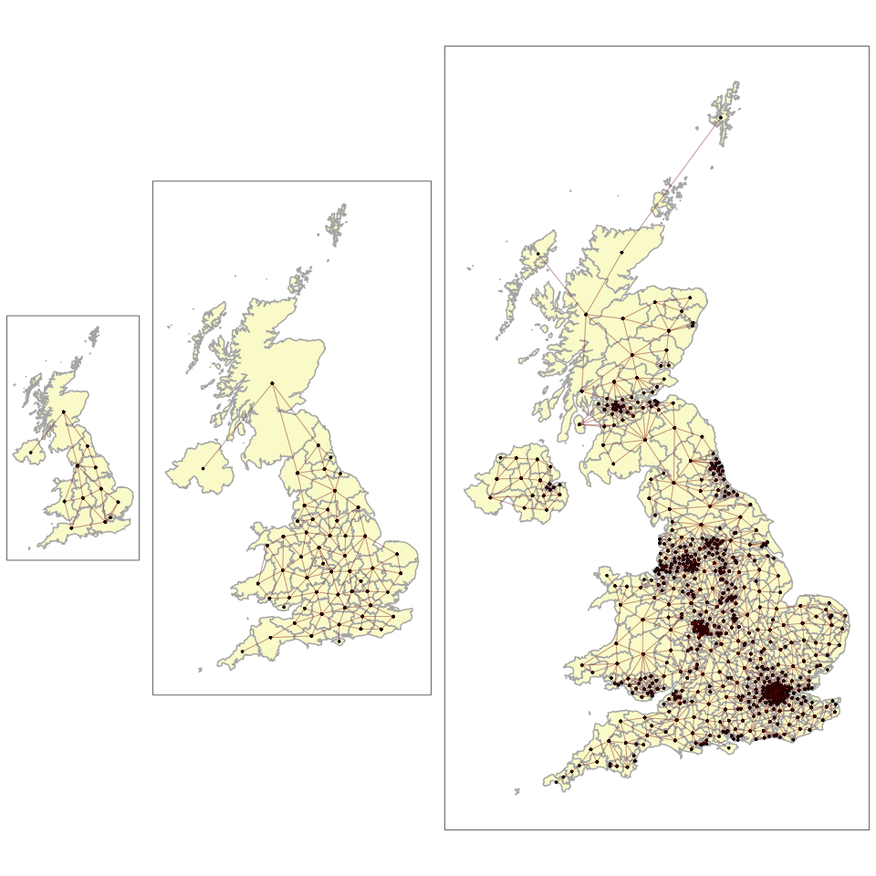
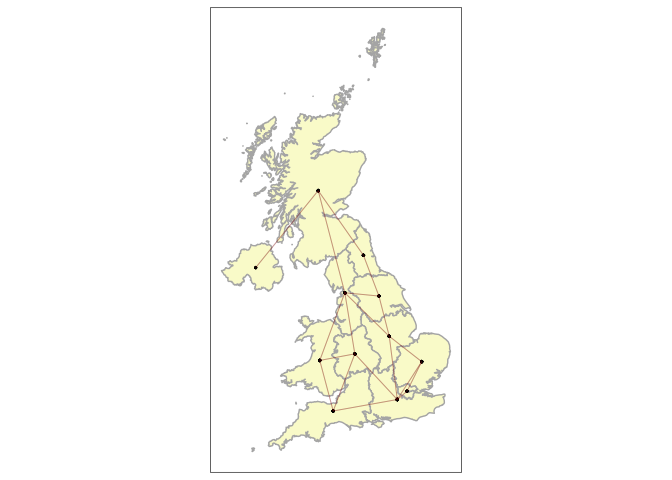
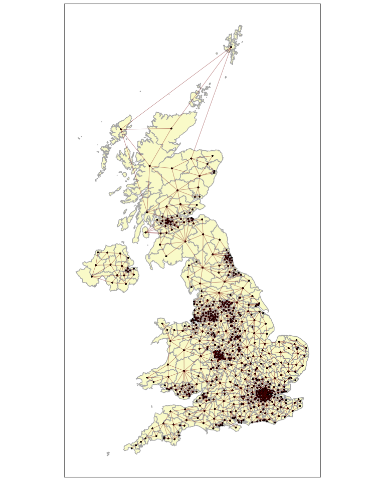
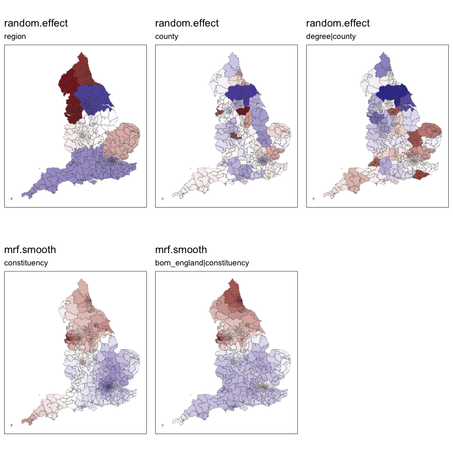

<!-- README.md is generated from README.Rmd. Please edit that file -->

# kh package

<!-- badges: start -->
<!-- badges: end -->

The goal of `kh` is to make it easier to fit areal spatial models which
deal with contiguity.

It aims to do this with a collection of pre- and post-processing tools.

Two packages which are commonly used to fit such models are `mgcv` and
`brms`.

**1. Pre-processing tools:** This package has functions which take an
`sf` spatial object and generate a contiguity structure in the form
which is required by the modelling package.

| Function                | Stage      | Purpose                                                                                                              |
|-------------------|-------------------|----------------------------------|
| make_contigs()          | **CREATE** | generates a contiguity object, by any chosen level, with the option of joining islands to their nearest k neighbours |
| quickmap_contigs()      | **CHECK**  | generates a quick-reference contiguity map of a contiguity object                                                    |
| find_neighbours()       | **EDIT**   | outputs the names of any unit’s neighbours within the contiguity object                                              |
| manual_link_name()      | **EDIT**   | link two units (by name) as neighbours which are not already neighbours                                              |
| manual_unlink_name()    | **EDIT**   | unlink two units (by name) which are currently neighbours                                                            |
| manual_link_numeric()   | **EDIT**   | link two units (by index number) as neighbours which are not already neighbours                                      |
| manual_unlink_numeric() | **EDIT**   | unlink two units (by index number) which are currently neighbours                                                    |

**2. Fit the model:** The model can then be fit as normal within `mgcv`
or `brms`.

**3. Post-processing tools:** These can then extract the results of the
model into a tidy `sf` format so they can easily be mapped.

| Function         | Purpose               |
|------------------|-----------------------|
| tidy_estimates() | **TIDY RESULTS**      |
| quickmap()       | **VISUALISE RESULTS** |

## Installation

You can install the development version of `kh` from
[GitHub](https://github.com/) with:

``` r
# install.packages("devtools")
devtools::install_github("horankev/kh")
```

For this example, we load some spatial data from these sources:

``` r
# required packages
packages <- c(
  "rnaturalearth",
  "sf",
  "tidyverse",
  "parlitools",
  "ggpubr",
  "mgcv"
  )

# Install packages not yet installed
installed_packages <- packages %in% rownames(installed.packages())
if (any(installed_packages == FALSE)) {
  install.packages(packages[!installed_packages])
}

# Packages loading
invisible(lapply(packages, library, character.only = TRUE, quietly = TRUE))
```

## Functions

Often when preparing areal spatial data, the presence of uncontiguous
areas (such as islands or exclaves) can create difficulties. We might
also want to account for some hidden contiguities by allowing bridges,
tunnels etc. to render two uncontiguous areas as neighbours. These
*pre-processing* functions help to make the process of generating
neighbourhood structures less complicated.

### Use of pre-processing functions

The following set of functions are useful for preparing a neighbourhood
structure from an `sf` object for use with `mgcv`. They suggest three
stages in this process: *creation*, *checking* and *editing*. The second
and third can be looped as necessary. First *create* a contiguity list,
then *check* a map of it to see if it looks appropriate. Functions for
further manual *editing* can then be used until it looks as it should.

| Function                | Stage      | Purpose                                                                                                              |
|-------------------|-------------------|----------------------------------|
| make_contigs()          | **CREATE** | generates a contiguity object, by any chosen level, with the option of joining islands to their nearest k neighbours |
| quickmap_contigs()      | **CHECK**  | generates a quick-reference contiguity map of a contiguity object                                                    |
| find_neighbours()       | **EDIT**   | outputs the names of any unit’s neighbours within the contiguity object                                              |
| manual_link_name()      | **EDIT**   | link two units (by name) as neighbours which are not already neighbours                                              |
| manual_unlink_name()    | **EDIT**   | unlink two units (by name) which are currently neighbours                                                            |
| manual_link_numeric()   | **EDIT**   | link two units (by index number) as neighbours which are not already neighbours                                      |
| manual_unlink_numeric() | **EDIT**   | unlink two units (by index number) which are currently neighbours                                                    |

``` r
library(kh)
## basic example code
```

#### make_contigs()

#### quickmap_contigs()

The following is a map of Indonesia from the `rnaturalearth` package. It
features many non-contiguous units. In the following example of
`make_contigs`, the argument k is set to one. This means that in
addition to all of the normal contiguities, all islands will be joined
to the one unit which is closest to them. This can be piped into the
`quickmap_contigs` function so that the contiguities can be visually
inspected.

For a country with many islands such as Indonesia, we can compute
contiguities by individual island:

``` r

indonesia <- ne_states(country="indonesia", returnclass = "sf") |> 
  st_cast("POLYGON")
indonesia$id <-1:nrow(indonesia)
indonesia_cont <- make_contigs(data = indonesia,
                               unit = id,
                               link_islands_k = 1, 
                               modelling.package = "brms") |> 
  quickmap_contigs(indonesia, id)
```


Rather than operating at the individual island level, this can be done
at a higher provincial level by changing an argument in the function.

``` r

indonesia <- ne_states(country="indonesia", returnclass = "sf") |> 
  st_cast("POLYGON")
indonesia$id <-1:nrow(indonesia)
indonesia_cont <- make_contigs(data = indonesia,
                               unit = name,
                               link_islands_k = 2,
                               modelling.package = "mgcv") |> 
  quickmap_contigs(indonesia, name)
```


If we wish to use `mgcv`, we get a neighbourhood list:

``` r

make_contigs(data = indonesia,
             unit = name,
             link_islands_k = 2,
             modelling.package = "mgcv") |> 
  head(8)
#> $Aceh
#> [1] 32
#> 
#> $Bali
#> [1] 11 20
#> 
#> $`Bangka-Belitung`
#> [1]  8 31
#> 
#> $Banten
#> [1] 7 9
#> 
#> $Bengkulu
#> [1]  8 17 30 31
#> 
#> $Gorontalo
#> [1] 27 29
#> 
#> $`Jakarta Raya`
#> [1] 4 9
#> 
#> $Jambi
#> [1]  3  5 16 24 30 31
```

Or we can get a neighbourhood matrix by selecting `brms`:

``` r

temp <- make_contigs(data = indonesia,
                     unit = name,
                     link_islands_k = 2,
                     modelling.package = "brms") 
temp[1:10,1:10]
#>                 [,1] [,2] [,3] [,4] [,5] [,6] [,7] [,8] [,9] [,10]
#> Aceh               0    0    0    0    0    0    0    0    0     0
#> Bali               0    0    0    0    0    0    0    0    0     0
#> Bangka-Belitung    0    0    0    0    0    0    0    1    0     0
#> Banten             0    0    0    0    0    0    1    0    1     0
#> Bengkulu           0    0    0    0    0    0    0    1    0     0
#> Gorontalo          0    0    0    0    0    0    0    0    0     0
#> Jakarta Raya       0    0    0    1    0    0    0    0    1     0
#> Jambi              0    0    1    0    1    0    0    0    0     0
#> Jawa Barat         0    0    0    1    0    0    1    0    0     1
#> Jawa Tengah        0    0    0    0    0    0    0    0    1     0
```

The k value could be changed to 2 to join each island to the two closest
units as in this example with the countries of Asia.

``` r

asia <- ne_countries(continent="asia", returnclass = "sf")
asia_cont <- make_contigs(data = asia,
                    unit = admin,
                    link_islands_k = 2) |> 
  quickmap_contigs(asia, admin)
```


``` r

make_contigs(data = asia,
             unit = admin,
             link_islands_k = 2,
             modelling.package = "mgcv") |> 
  head(8)
#> $Afghanistan
#> [1]  8 14 31 40 43 45
#> 
#> $Armenia
#> [1]  3 11 14 42
#> 
#> $Azerbaijan
#> [1]  2 11 14 42
#> 
#> $Bangladesh
#> [1] 12 26
#> 
#> $Bhutan
#> [1]  8 12
#> 
#> $Brunei
#> [1] 24 33
#> 
#> $Cambodia
#> [1] 22 41 46
#> 
#> $China
#>  [1]  1  5 12 19 21 22 25 26 27 28 31 39 40 46
```

``` r

temp <- make_contigs(data = asia,
                     unit = admin,
                     link_islands_k = 2,
                     modelling.package = "brms")
temp[1:10,1:10]
#>             [,1] [,2] [,3] [,4] [,5] [,6] [,7] [,8] [,9] [,10]
#> Afghanistan    0    0    0    0    0    0    0    1    0     0
#> Armenia        0    0    1    0    0    0    0    0    0     0
#> Azerbaijan     0    1    0    0    0    0    0    0    0     0
#> Bangladesh     0    0    0    0    0    0    0    0    0     0
#> Bhutan         0    0    0    0    0    0    0    1    0     0
#> Brunei         0    0    0    0    0    0    0    0    0     0
#> Cambodia       0    0    0    0    0    0    0    0    0     0
#> China          1    0    0    0    1    0    0    0    0     0
#> Cyprus         0    0    0    0    0    0    0    0    0     0
#> East Timor     0    0    0    0    0    0    0    0    0     0
```

Applied to the situation of modelling voting behaviour in the UK, we can
set up contiguities according to administrative level.

``` r

# prepare the data
# extract and join census and election data from parlitools package
census_11 <- parlitools::census_11 |> 
  select(-constituency_name,-constituency_type,-pano, -region, -country)
bes_2019 <- parlitools::bes_2019

elect_results <- left_join(bes_2019,census_11, by=c("ons_const_id"))
uk_map_download <- st_read(
  "https://services1.arcgis.com/ESMARspQHYMw9BZ9/arcgis/rest/services/WPC_Dec_2019_UGCB_UK_2022/FeatureServer/0/query?outFields=*&where=1%3D1&f=geojson",
  quiet = TRUE)

# only need the boundaries and the IDs for merging with parlitools data
uk <- uk_map_download |> 
  select(pcon19cd,geometry) |> 
  st_transform(crs=27700)

uk_admins <- elect_results |> 
  left_join(uk, by=c("ons_const_id"="pcon19cd")) |> 
  mutate(region = factor(region),
         county = factor(county),
         constituency_name = factor(constituency_name),
         geometry = geometry) |> 
  rename(constituency = constituency_name) |> 
  st_as_sf()
```

Contiguities as set up for regions, counties and constituencies:

``` r

ggarrange(
uk_admins |> 
  make_contigs(unit = region,
                    link_islands_k = 1) |> 
  quickmap_contigs(uk_admins, region),

uk_admins |> 
  make_contigs(unit = county,
                    link_islands_k = 1) |> 
  quickmap_contigs(uk_admins, county),

uk_admins |> 
  make_contigs(unit = constituency,
                    link_islands_k = 1) |> 
  quickmap_contigs(uk_admins, constituency),

ncol=3,
widths = c(1,2,3)
)
```



### Use of checking/editing functions

We might want to alter the contiguities based on some subject-matter
knowledge. Perhaps some islands are more closely linked to some mainland
areas than to others due to, for example, a ferry service.

The following functions allow constituencies to be manually paired or
unpaired as necessary.

#### manual_link_name()

#### manual_unlink_name()

#### manual_link_numeric()

#### manual_unlink_numeric()

We can use `manual_link_name` to add additional contiguities using the
name of the units. This can also be done using the number of the unit
(which is provided in the neighbourhood list, rather than the names)
using `manual_link_numeric`. Here we link Northern Ireland to Cornwall:

``` r

make_contigs(data = uk_admins,
                    unit = county,
                    link_islands_k = 1) |> 
  manual_link_name("Northern Ireland","Cornwall") |> 
  quickmap_contigs(uk_admins, county)
```


or `manual_unlink_name` to unlink units using their names. Here, we
unlink the East and West Midlands, and also the North West and North
East:

``` r

make_contigs(data = uk_admins,
                    unit = region,
                    link_islands_k = 1) |> 
  manual_unlink_name("East Midlands","West Midlands") |> 
  manual_unlink_name("North West","North East") |> 
  quickmap_contigs(uk_admins, region)
```



In the following example, we link island constituencies to their nearest
3 constituencies:

``` r

uk_admins |> 
  make_contigs(unit = constituency,
                    link_islands_k = 3) |> 
  quickmap_contigs(uk_admins, constituency)
```



#### find_neighbours()

But which three constituencies have now been link to the Isle of Wight?
Using the `find_neighbours` function…

``` r

uk_admins |> 
  make_contigs(unit = constituency,
                      link_islands_k = 3) |> 
  find_neighbours("Isle Of Wight")
#> [1] "Gosport"         "New Forest East" "New Forest West"
```

I only wanted Gosport. So I will remove the other two…

``` r

uk_admins |> 
  make_contigs(unit = constituency,
                      link_islands_k = 3) |> 
  manual_unlink_name("Isle Of Wight","New Forest East") |> 
  manual_unlink_name("Isle Of Wight","New Forest West") |> 
  find_neighbours("Isle Of Wight")
#> [1] "Gosport"
```

### Use of post-processing functions

| Function         | Purpose               |
|------------------|-----------------------|
| tidy_estimates() | **TIDY RESULTS**      |
| quickmap()       | **VISUALISE RESULTS** |

The function `tidy_estimates` takes a fitted `mgcv::gam` model and
returns computed estimates and standard errors for any random effects
and/or Markov random field spatial smoothing components, attached to an
appropriate (spatial) dataframe.

## Modelling example from UK

The functions mentioned above are used together and in sequence in the
following worked example, which examines voting behaviour in the UK
using a multilevel modelling stucture with an ICAR component at the
lowest level.

First use the pre-functions:

``` r

nb_england <- uk_admins |> 
  filter(country %in% "England") |> 
  make_contigs(unit = constituency,                        # make contiguities at this level
                    link_islands_k = 3) |>                 # link islands to their three closest neighbours
  manual_unlink_name("Isle Of Wight","New Forest East") |> # due to local knowledge, we don't want this connection
  manual_unlink_name("Isle Of Wight","New Forest West")    # and we don't want this connection
  
df_england <- uk_admins |> 
  filter(country %in% "England") |>                        # let's just focus on England
  mutate(constituency = factor(constituency))              # `mgcv` requires the ICAR level as a factor
```

Then fit a `gam` model with a combination of random effects and ICAR
components. This particular model has:

-   fixed intercept,

-   three fixed slopes (*born_england*, *deprived_1* and *degree*),

-   random intercepts at *region* and *county* levels,

-   random slope at *county* level for *degree*,

-   ICAR varying intercept at *constituency* level, and

-   ICAR varying slopes at *constituency* level for *born_england*.

``` r

model <- gam(con_17 ~ 
               born_england + 
               deprived_1 +
               degree + 
               s(region, bs="re") +
               s(county, bs="re") +
               s(county, degree, bs="re") +
               s(constituency, bs='mrf', xt=list(nb=nb_england),k=50) +
               s(constituency, by=born_england, bs='mrf', xt=list(nb=nb_england),k=50),
             data=df_england, method="REML")
```

Then use the post-functions to generate output:

#### tidy_estimates()

``` r

output <- tidy_estimates(model, df_england) # get estimates from `model` attached to `df_england`
```

The output shown below displays the estimates and standard errors of
each component of the model for the first 5 constituencies
alphabetically, as an `sf` dataframe which can be easily mapped:

``` r

head(output[,1:10])
#> Simple feature collection with 6 features and 10 fields
#> Geometry type: MULTIPOLYGON
#> Dimension:     XY
#> Bounding box:  xmin: 368282 ymin: 101579.6 xmax: 532401.3 ymax: 393553.9
#> Projected CRS: OSGB36 / British National Grid
#>   random.effect.region random.effect.county random.effect.degree|county
#> 1         9.106699e-05         0.0022038150                  0.12544536
#> 2        -1.276271e-05        -0.0040218262                  0.01806311
#> 3        -1.915533e-04         0.0004535066                  0.03735045
#> 4         1.403770e-06         0.0002235744                  0.20328894
#> 5         9.106699e-05         0.0011533002                  0.10133193
#> 6         1.403770e-06        -0.0020776751                 -0.12805643
#>   mrf.smooth.constituency mrf.smooth.born_england|constituency
#> 1                8.191301                          0.044261369
#> 2               -1.914969                          0.018425793
#> 3              -15.020994                         -0.053140703
#> 4               -5.521289                         -0.007640393
#> 5                2.766880                          0.017852827
#> 6               -5.843950                         -0.009806297
#>   se.random.effect.region se.random.effect.county
#> 1              0.02519786               0.1029829
#> 2              0.02519795               0.1029725
#> 3              0.02519802               0.1029684
#> 4              0.02519771               0.1029772
#> 5              0.02519786               0.1029870
#> 6              0.02519771               0.1029781
#>   se.random.effect.degree|county se.mrf.smooth.constituency
#> 1                      0.1755541                   3.967701
#> 2                      0.1725884                   2.982417
#> 3                      0.1553289                   4.194030
#> 4                      0.1803089                   3.253374
#> 5                      0.1969387                   5.028727
#> 6                      0.1872917                   3.550224
#>   se.mrf.smooth.born_england|constituency                       geometry
#> 1                              0.03873321 MULTIPOLYGON (((485408.1 15...
#> 2                              0.03028813 MULTIPOLYGON (((406519.5 30...
#> 3                              0.04114809 MULTIPOLYGON (((379104.1 39...
#> 4                              0.03199243 MULTIPOLYGON (((444868.5 35...
#> 5                              0.05088886 MULTIPOLYGON (((506643.3 12...
#> 6                              0.03458959 MULTIPOLYGON (((449576.1 36...
```

#### quickmap()

A list containing plots (maps, as they are spatial) of the components
can be generated with this function:

``` r

plot_list <- quickmap(output)      # function to turn the above output into a list of quick maps
ggarrange(plotlist = plot_list,    # ggarrange can plot a list of plots with control over layout
          legend = "none",
          ncol = 3,
          nrow = 2)
```


